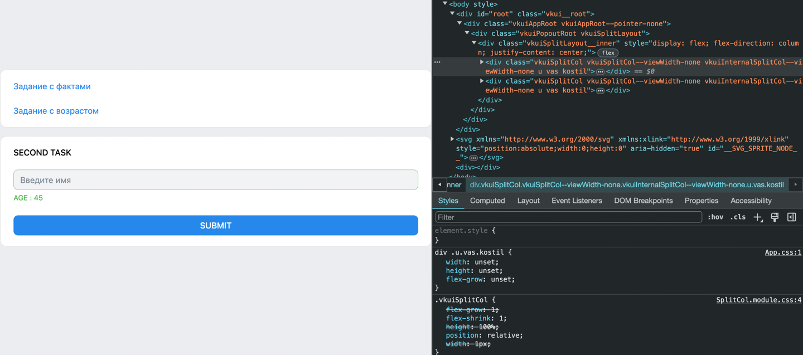
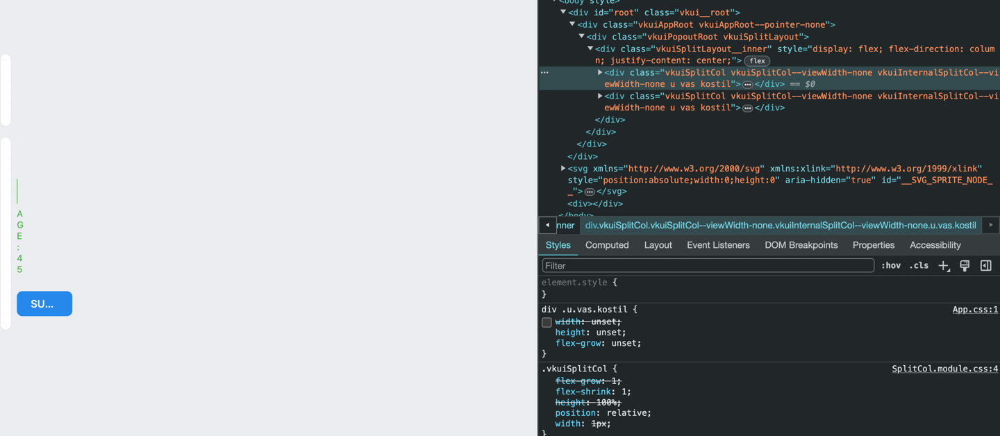

*Disclaimer*: На работу было потрачено не мало сил, поэтому если по итогу проверки вы оставите комментарий хотя бы в
ишью, то будет очень славно

# Для локального запуска

## Node version: `21.1.0`

## NPM version: `10.2.0`

# Для деплоя

## Node version: `16.15.0`

## NPM version: `8.5.5`

Также для деплоя в `package.json` нужно добавить

```json
"devDependencies": {
"@vkontakte/vk-miniapps-deploy": "^0.1.6",
"@vkontakte/vk-bridge": "^2.14.1",
"@vkontakte/vk-tunnel": "^0.1.4"
}
```

Так же нужно в корень добавить файл `vk-hosting-config.json` с вот таким содержанием:

```json
{
  "static_path": "build",
  "app_id": "<Ваш id приложения>",
  "endpoints": {
    "mobile": "index.html",
    "mvk": "index.html",
    "web": "index.html"
  }
}
```

Я запушил в *main* версию для локального запуска, дабы не засорять ее.
В идеале для деплоя нужно создать отдельную ветку и уже туда пушить ее.

## Скрипты для запуска

### `npm install`

### `npm start`

## Что нужно было сделать

Нужно было сделать приложения состоящие из двух частей:

- По запросу на *api* получать факт о котах и устанавливать курсор после первого слова
- Отправлять запрос на *api* с введенным именем, и отдавать получившийся возраст, либо выводить ошибку.

## Что было сделано

### Первое задание

В первом задании был сделан *Input* и кнопка которая отправляла запрос на апи, после этого в *Input* выводился факт о
котах,
с курсором установленным после 1 слова. Если что-нибудь ввести в input, то факт затрет то, что там было. Добавлена
обработка ошибок,
если *api* отдаст респонс не с 200 кодом или без `data`.

### Второе задание
Во втором задании был сделан *Input* который принимает на вход строчку состоящую из латинских букв.
Далее делается запрос на *api* по истечении 3х секунд после последнего ввденного символа, либо после нажатия на кнопку
отправки.
Также была реализована отмена предыдущего запроса (для кейса с медленным интернетом). Если респонс придет не с 200
кодом или без `data` то будет выведена ошибка.
Также частый кейс, это если строка валидная и респонс пришел с 200 кодом, но в поле `data` `age = null`, то будет
выведена ошибка.
Кэширование было реализовано с помощью *localStorage*. Запросы приводящие к ошибке (где у респонса был 200 код и было
поле `data`, но не было поля `age`) не кэшировались
ибо реальность такова, что это может быть просто ошибка сервера, и на такой же запрос, но позже, будет положительный
результат.

## Дополнительные задания

Были выполнены первые три (и чуть-чуть 4) дополнительных задания.

- Я попытался следовать архитектурно методологии Feature-Sliced Design, разделить все на логические сегменты.
- Была добавлена валидация вводимого имени (производится после *submit*, можно было сделать и live-validation)
- Приложение было развернуто в виде мини-приложения ВК

## PS
При использовании *VK-UI* наткнулся на баг/костыль, не знаю. У компонента `SplitCol` в стилях задана ширина `width: 1px`.
Из-за этого было очень сложно расположить активные блоки так, как получилось. Пришлось навешивать много классов, чтобы приоритет был выше,
ибо ни *inline-style*, ни *inline-style* c *!important* не позволяли изменить ширину колонки.



 


